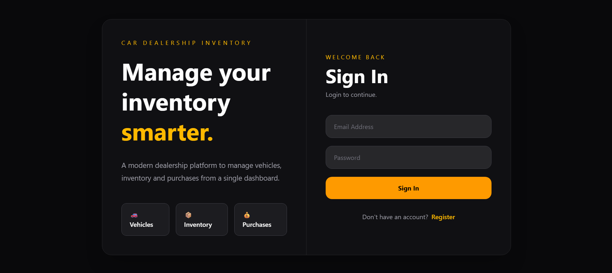
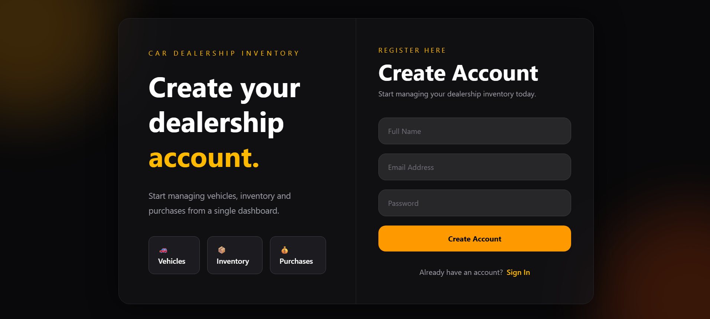
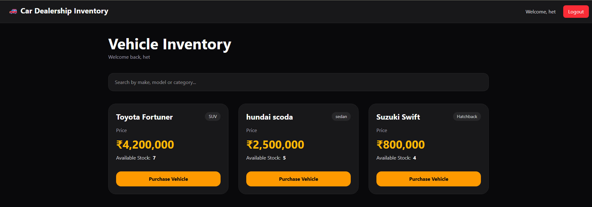
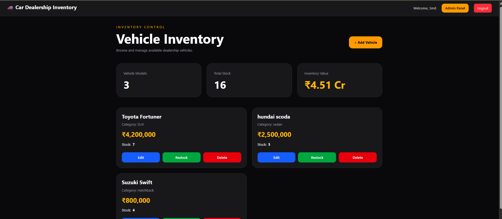
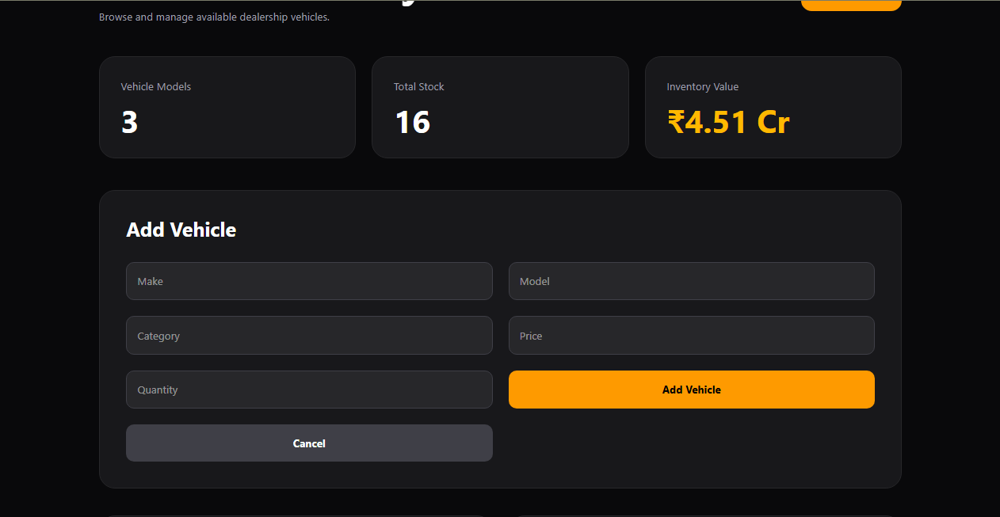

# Car Dealership Inventory Management System

A full-stack Car Dealership Inventory Management System built using the MERN stack following Test-Driven Development (TDD) principles for the Incubyte assessment.

The platform allows customers to browse and purchase vehicles while administrators manage dealership inventory through a dedicated dashboard.

---

# Features

## Authentication

- User Registration
- User Login
- JWT Authentication
- Password hashing using bcrypt
- Role-based access control
- Protected frontend routes
- Protected backend APIs

## Customer Features

- Browse available vehicles
- Search vehicles by make, model, or category
- Purchase available vehicles
- Automatic stock reduction after purchase
- Out-of-stock purchase protection
- View inventory in real-time

## Admin Features

- Add new vehicles
- Update vehicle category and price
- Restock inventory
- Delete vehicles
- Inventory analytics dashboard
- Duplicate vehicle prevention
- Role-based UI controls

---

# Tech Stack

## Frontend

- React
- Vite
- React Router DOM
- Axios
- Tailwind CSS

## Backend

- Node.js
- Express.js
- MongoDB
- Mongoose
- JWT Authentication
- bcryptjs

## Development Tools

- Git
- GitHub
- Postman
- Visual Studio Code
- ChatGPT
- Gemini

---

# Project Structure

```text
car-dealership-inventory/
│
├── backend/
│   ├── config/
│   ├── controllers/
│   ├── middleware/
│   ├── models/
│   ├── routes/
│   ├── server.js
│   └── package.json
│
├── frontend/
│   ├── src/
│   │   ├── components/
│   │   ├── pages/
│   │   ├── services/
│   │   ├── App.jsx
│   │   └── main.jsx
│   │
│   └── package.json
│
├── screenshots/
│
├── README.md
└── .gitignore
```

---

# Installation

## Clone Repository

```bash
git clone https://github.com/smitkachariya/car-dealership-inventory.git

cd car-dealership-inventory
```

---

## Backend Setup

```bash
cd backend

npm install

npm run dev
```

Create a `.env` file inside the backend folder:

```env
PORT=5000
MONGO_URI=your_mongodb_connection_string
JWT_SECRET=your_secret_key
```

Backend server runs on:

```text
http://localhost:5000
```

---

## Frontend Setup

Open another terminal:

```bash
cd frontend

npm install

npm run dev
```

Frontend runs on:

```text
http://localhost:5173
```

---

# API Endpoints

## Authentication

| Method | Endpoint           | Description   |
| ------ | ------------------ | ------------- |
| POST   | /api/auth/register | Register user |
| POST   | /api/auth/login    | Login user    |

## Vehicles

| Method | Endpoint                   | Description       |
| ------ | -------------------------- | ----------------- |
| GET    | /api/vehicles              | Get all vehicles  |
| POST   | /api/vehicles              | Add vehicle       |
| PUT    | /api/vehicles/:id          | Update vehicle    |
| DELETE | /api/vehicles/:id          | Delete vehicle    |
| POST   | /api/vehicles/:id/purchase | Purchase vehicle  |
| POST   | /api/vehicles/:id/restock  | Restock inventory |

---

# Role Based Access

## User

Users can:

- Register and Login
- Browse available vehicles
- Search inventory
- Purchase vehicles

## Admin

Administrators can:

- Add vehicles
- Update vehicle information
- Restock inventory
- Delete vehicles
- View inventory analytics

---

# Validation and Testing

The application was verified using:

- Manual frontend testing
- API testing using Postman
- Authentication flow validation
- Role-based access verification
- Inventory workflow testing

## Tested Scenarios

- User registration
- User login
- JWT authentication
- Vehicle listing
- Vehicle creation
- Vehicle purchasing
- Out-of-stock protection
- Vehicle restocking
- Vehicle deletion
- Role-based authorization
- Protected routes

---

# Development Process

The project followed an incremental Red-Green-Refactor inspired workflow during development.

Example commit flow:

```text
test: add failing vehicle purchase tests
feat: implement vehicle purchase workflow
refactor: improve inventory handling

test: add failing admin inventory tests
feat: implement admin inventory operations
refactor: simplify dashboard workflow
```

---

# Planned Features

During development, a Purchase schema and model were designed to support future enhancements including:

- Purchase history tracking
- User-specific purchase records
- Purchase analytics
- User purchase dashboard
- Admin sales reporting

Due to assessment time constraints, the purchase persistence layer and purchase history UI were not completed, but the database structure was prepared to support these features in future iterations.

---

# Screenshots

## Login Page



---

## Register Page



---

## User Dashboard



---

## Admin Dashboard



---

## Add Vehicle



---

# AI Usage

AI tools such as ChatGPT and Gemini were used selectively during development for:

- Debugging backend and frontend integration issues.
- Discussing JWT authentication and authorization.
- Reviewing React component structure and routing.
- Improving UI layout and styling decisions.
- Discussing Git commit organization and TDD workflows.

AI assistance was used as a development aid rather than a replacement for implementation and testing.

All AI-generated suggestions were reviewed, modified where necessary, and validated before integration into the project.

---

# Security

- Passwords are hashed using bcrypt.
- JWT is used for token-based authentication.
- Protected endpoints require valid authentication.
- Admin-only operations use role-based authorization.
- Environment variables are stored in `.env`.
- Sensitive files are excluded using `.gitignore`.

---

# Author

**Smit Kachariya**

B.Tech Computer Engineering  
Dharmsinh Desai University

GitHub: https://github.com/smitkachariya

---

# Project Purpose

This project was developed as part of the Incubyte assessment to demonstrate:

- Full-stack development
- REST API design
- Authentication and authorization
- Database integration
- Frontend development
- Git workflows
- Responsible AI-assisted software development
